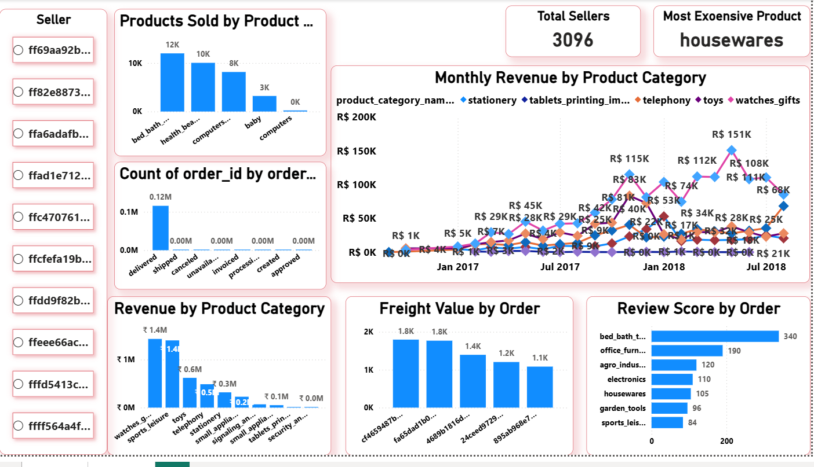

# E-Commerce Sales(2016-2018) - Retail Analysis
This project analyzes an e-commerce dataset to discove meaningfull insights. Using SQL Analysis, Python EDA, Power-BI Visual Dashboard.

## Table of contents
  - [Overview](#overview)
  - [Business Problem](#business-problem)
  - [Dataset](#dataset)
  - [Tools & Techonologies](#tools--techonologies)
  - [Project Workflow](#project-workflow)
  - [Project Structure](#project-structure)
  - [Exploratory Data Analysis](#exploratory-data-analysis)
  - [Dashboard](#dashboard)
  - [Key Insights](#key-insights)
  - [Recommendation](#recommendation)
  - [Contact](#contact)

  
## Overview
This project analysis a real-world dataset to uncover trends in revenue, customer behaviour, product performance, seller performance, and delivery operations. The goal is to generate actionable business insights The dataset has information of 100k orders from 2016 to 2018 made at multiple marketplaces. A complete pipline was build using SQL for cleaning, Python for Analys and Power BI for Visualization.
## Business Problem
  - Unclear which product categories and sellers contribute the most to revenue.
  - Delivery delays may be impacting customer satisfaction and review scores.
  - Products with higher weight tend to increase significantly higher freight costs, but the impact of product weight on overall shipping expenses and profitability is not clearly analyzed.
  - Revenue performance is fragmented across time, making it difficult to identify seasonality, growth patterns, and declining periods.
  - High-priced products exist, but their contribution to overall revenue is not clearly understood.

## Dataset
Multiple CSV files located in /data/ folder 
  - customers
  - geolocation
  - order_item
  - order_payments 
  - order_reviews 
  - orders 
  - product_category_name_translation 
  - products 
  - sellers

## Tools & Techonologies
### Python
- Pandas and Matplotlib
- Seaborn and Numpy
- Data cleaning 
- Exploratory analysis & Visualization

### SQL(PostgreSQL)
- Data Extraction
- Handling Null and Duplicate values
- Joining multiple tables into a unified dataset

### Power BI
- Intractive Dashboard
- Created several DAX measures to build clear and intractive visuals
- Month-wise trends
- Most Expensive Product

## Project Workflow

1. Imported all CSV files into PostgreSQL  
    - Use JOINS for joining multiple tables 

2. Imported all files from PostgreSQL into Pythen  
   - Cleaned and analized data

3. Performed EDA:

    -  Customers behavior

    - Orders trends

    - Products performance

    - Sellers concentration

4. Exported cleaned data to Power BI

5. Designed a dynamic & user-friendly dashboard

6. Generated insights and recommendations

## Project Structure

```
Hospital-Management-Analytics/
├── data/                        # Raw and cleaned datasets
│   ├── customers.csv
│   ├── geolocation.csv
│   ├── order_item.csv
│   └── order_payments.csv
│   └── order_reviews.csv
    └──orders.csv
    └──product_category_name_translation.csv
    └──products.csv
    └──sellers.csv
├── notebooks/            # EDA and data cleaning notebooks
│   ├── connection.ipynb
│   └── EDA.ipynb
├── sql_files/                 # SQL scripts
│   ├── join_tables.sql
├── dashboard/
│   └── e-commerce-dashboard.pbix
├── images/
│   └── e-commerce-dashboard1.png
    └──e-commerce-dashboard2.png
├── README.md
└── requirements.txt
```

## Exploratory Data Analysis

###  Analysis according Orders
  - Total Delivered Orders: - 120000
  - Maximum Customers with Highest Orders - 63
  - Top City and State  by order Volume- sao paulo, SP(18872 orders)
  - Maximum Delivery Delay Observed: 209 days
  - Top Order with Best Review - bed_bath_table - 340 
  - Highest Freight Value for a Single Order: ₹1,794.96
  
### Revenue Analysis(2016–2018)
  - Total Revenue: - 20.58M
  - Top 5 Product Categories by Monthly Revenue Contribution:
      1. Furniture-_decor
      2. Health_beauty
      3. Bed_bath_table
      4. Computer_accessories
      5. Watches_gifts
  - Highest Revenue-Generating Category: Watches & Gifts (1.43M)
  
### Analysis By Product
  - Total number of Product Sold - 119k
  - Highest Price Product Category - health_beauty(1,24589.90)
  - Most Expensive Product Category overall - Housewares
  
## Dashboard 

 
- Analyzing Month-wise Revenue trends
- Monthly Revenue by Product Category
- Highest Review Score gained by orders
- Hieghest Product Price
- Total Product Sold 119k
   
## Key Insights
 1. Payment Behavior
      - Credit cards account for 74% of all transactions, establishing them as the primary payment method for customers.
      - With nearly 20% of transactions using boleto, non-card payment options remain critical for customer inclusion and order conversion. 
      - Debit cards and vouchers together account for less than 7% of transactions, indicating very low customer adoption.
    
 2. Customers Purchase Analysis
     - Sao Paulo alone accounts for - 54% of total orders, making it the primary customer hub and the single most critical region for revenue and fulfillment performance.
     - Repeat customers account for only 3.1% of total customers, indicating extremely weak customer retention despite high new customer acquisition.
     - Repeat purchase activity is highly concentrated among a very small number of customers, with the top repeat customer placing over 63 orders.

  3. Orders Logistics Analysis
       - Most orders are delivered within a short time frame, but a small number of extreme delivery delays create a long tail that can severely impact customer satisfaction.
       - A small group of sellers and products drive a disproportionately high number of orders, highlighting strong sales concentration and dependency on top performers.
       - Just 5 orders account for over ₹1,900 in freight costs. Optimizing these few shipments can unlock big savings. 

## Recommendation

  - Introduce weight-based or distance-based shipping optimization to control delivery costs for heavy products.
  - Use post-delivery engagement (emails, offers, reminders) to encourage second purchases.
  - Review pricing and promotion strategies for high-revenue categories (Watches & Gifts, Furniture & Decor) to sustain profitability.
  - Identify underperforming sellers and provide performance guidelines or incentives to balance order distribution.
  
## Contact
- **Name**: Rafia
- **LinkedIn**: (www.linkedin.com/in/rafiakhan3023)
- **Email**: (rafiaqureshi2302@gmail.com)
